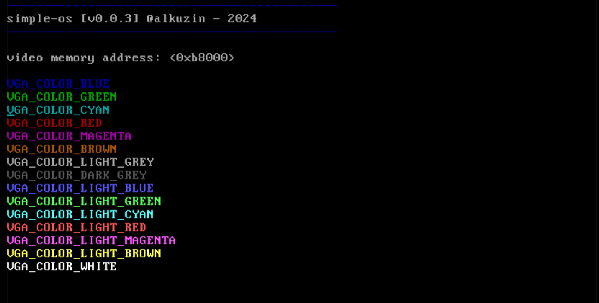
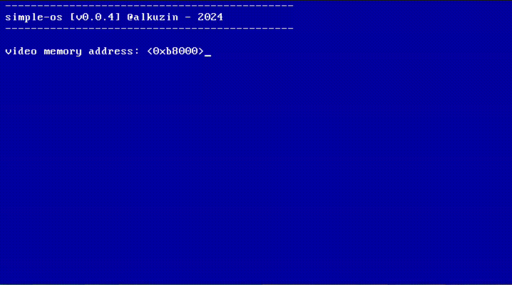
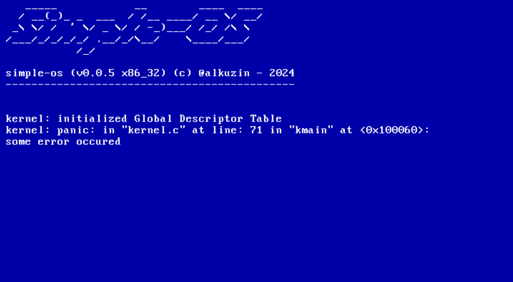
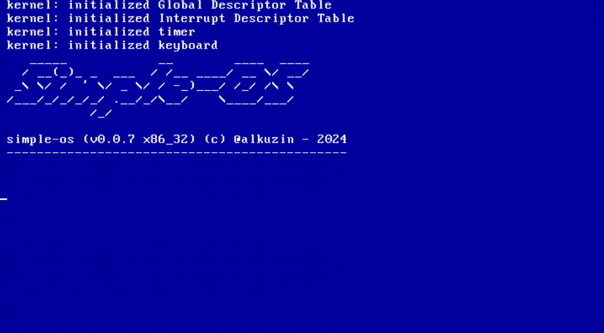
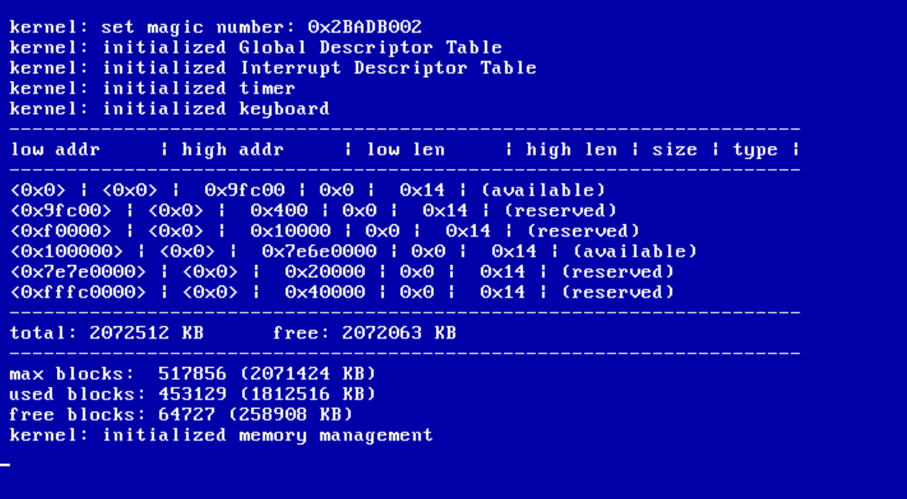
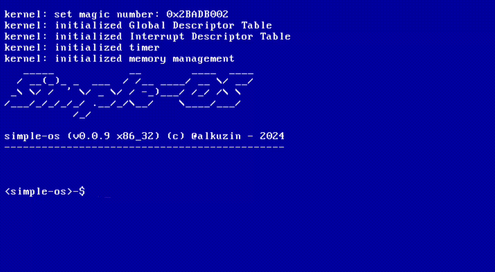
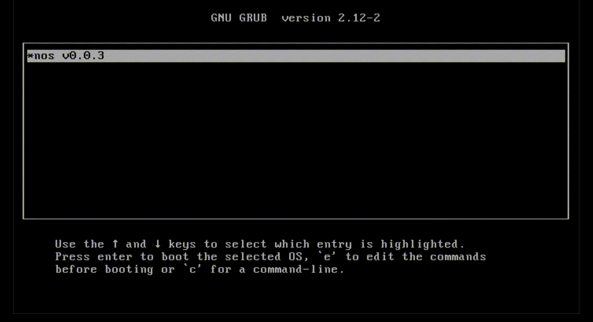

## Updates history

> NOS (v0.0.1) [was built on top of simple-os]:

- added `kmain()`
- added kernel library `libk` (`<string.h>`, `<ctype.h>`, `<stddef.h>`, `<stdint.h>`)
- added text output to VGA
- added `kprintf()` function (*%#xXidpusc* options of standard C library printf)
- added to libk `<stdarg.h>`, `<memory.h>`, `<math.h>`
- added VGA driver
- added color printing function `kprintc()` with 16 colors

- added `ksleep()` & `__ksleep()` functions in `<kernel.h>`
- modified VGA driver (added new functions: `update_cursor()`, `port_byte_out()`)
- added default background and foreground colors in `kernel/tty.h`
- added VGA scrolling (`__kscroll()`)

- added `\v` `\t` `\r` `\b` special characters support in `kputchar()`
- define a signed integer types in `<stdint.h>`
- added `kvprintf()` function
- added kernel halt `khalt()` & kernel panic `kpanic()` for detecting errors
- added Global Descriptor Table

- added ports in `<ports.h>`
- added TSS (Task State Segment) entry in `<gdt.h>`
- added IDT (Interrupt Descriptor Table) in `<idt.h>`
- added GNU GRUB support
- added IRQ (Interrupt Request) in `<irq.h>`
- added PIT (Programmable Interval Timer) in `<timer.h>`
- added keyboard driver in `<keyboard.h>`

- added multiboot information structure in `<multiboot.h>`
- added physical memory manager in `<pmm.h>`
- added virtual memory manager in `<vmm.h>`
- added main memory manager in `<mm.h>`

- added `kmalloc()` & `kfree()` functions for dynamic memory allocation
- added option to set default color
- added `keyboard_wait()` & `keyboard_getchar()` functions in `keyboadrd.h`
- added kernel shell in `ksh.h`
- added simple-os standard functions in `sstd.h`

> NOS (v0.0.2):

- added help menu to kernel shell
- separated libc and kernel library
- modified kernel TTY
- added CLI themes
- switched project to new `C23` standard
- added Doxygen documentation for header files

> NOS (v0.0.3):

- moved some inline assembly commands in `include/asm/` directory
- fixed issue with freeing available blocks of memory
- replaced `unistd.h` with `nosstd.h`
- made preparations for implementing `process manager` and `scheduler`
- made preparations for `kernel executable` structure
- added `Virtual File System`
- started implementation of `ext2` file system
- added `initial ramdisk`
- moved file types & permissions into `stat.h`
- added some file handeling functions like `open()`, `close()`, etc.
- added debug option to main makefile (GDB + QEMU)
- added `atoi()`, `strpbrk()` & `strtok()` functions
- added `cat` command (only for reading files) & new themes:

- added `ls` command
- added OS login
- added `tty_printc()` and `kputchar_c()` functions
- added colored shell prompt

