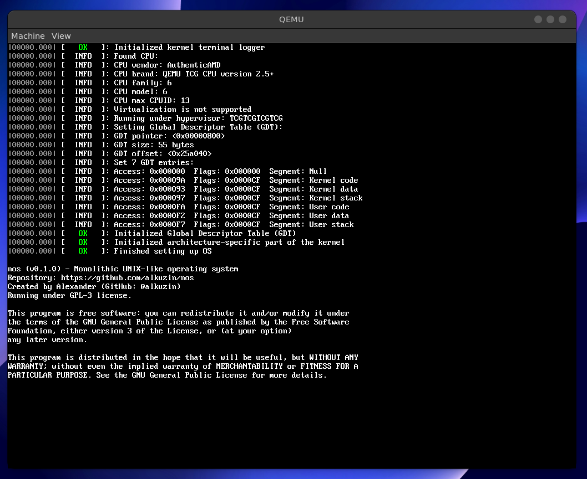

# Null Operating System changes log

## NOS release (v0.1.0)

|Language| files | blank | comment | code |
|--------|-------|-------|---------|------|
|Rust    | 20    | 265   | 533     | 1387 |
|Assembly| 2     | 28    | 21      | 81   |
|SUM:    | 22    | 293   | 554     | 1468 |

| Total lines | Size (with debug symbols) | Pure size              |
|-------------|---------------------------|------------------------|
| 2315        | 5339064 bytes (5.1 MB)    | 2339044 bytes (2.3 MB) |

* `[feat]`: added OS configuration data module
* `[feat]`: added colored output
* `[feat]`: added HAL initializing function
* `[feat]`: initialized Global Descriptor Table (GDT)
* `[feat]`: displayed CPU info during kernel initialization
* `[feat]`: added HAL CPU module
* `[feat]`: added x86 arch CPU module
* `[feat]`: added terminal logger
* `[feat]`: added Terminal struct
* `[feat]`: added kernel builtin font
* `[feat]`: initialized kernel graphics subsystem
* `[feat]`: added VBE driver
* `[feat]`: added logging macros
* `[feat]`: added kernel entry point
* `[feat]`: added kernel logging module
* `[feat]`: added HAL (Hardware Abstract Layer) module
* `[feat]`: added x86 architecture-specific code module
