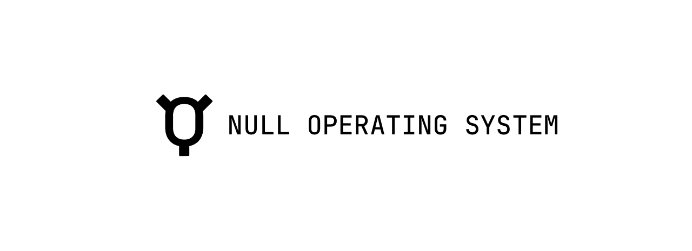

# The Null Operating System



## Description

NOS - hobby Unix-like x86-32 operating system. ([documentation](docs/README.md)).

Was built on top of ([simple os](https://github.com/alkuzin/simple-os)).

List of updates in [CHANGELOG.md](CHANGELOG.md)


## Installation

First clone this repository:
```console
https://github.com/alkuzin/nos.git
```

Then move to the `nos/` directory:
```console
cd nos/
```

To build kernel as `.iso` and run on QEMU use:
```console
make all && make init
```

To return everything to original state:
```console
make fclean
```

To initialize kernel in debug mode run:
```console
make debug
```


## License

MIT License

Copyright (c) 2024 Alexander (@alkuzin)

Permission is hereby granted, free of charge, to any person obtaining a copy
of this software and associated documentation files (the "Software"), to deal
in the Software without restriction, including without limitation the rights
to use, copy, modify, merge, publish, distribute, sublicense, and/or sell
copies of the Software, and to permit persons to whom the Software is
furnished to do so, subject to the following conditions:

The above copyright notice and this permission notice shall be included in all
copies or substantial portions of the Software.

THE SOFTWARE IS PROVIDED "AS IS", WITHOUT WARRANTY OF ANY KIND, EXPRESS OR
IMPLIED, INCLUDING BUT NOT LIMITED TO THE WARRANTIES OF MERCHANTABILITY,
FITNESS FOR A PARTICULAR PURPOSE AND NONINFRINGEMENT. IN NO EVENT SHALL THE
AUTHORS OR COPYRIGHT HOLDERS BE LIABLE FOR ANY CLAIM, DAMAGES OR OTHER
LIABILITY, WHETHER IN AN ACTION OF CONTRACT, TORT OR OTHERWISE, ARISING FROM,
OUT OF OR IN CONNECTION WITH THE SOFTWARE OR THE USE OR OTHER DEALINGS IN THE
SOFTWARE.