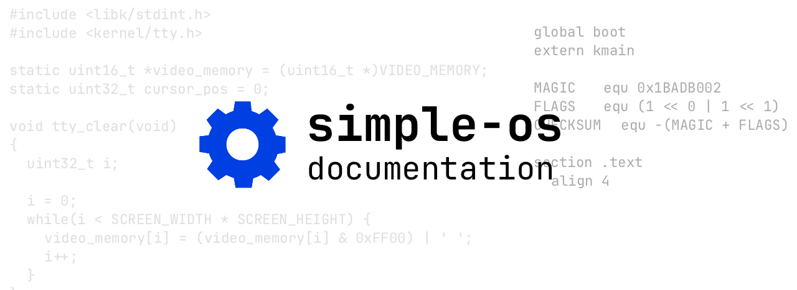

# Simple OS documentation



## Contents

1. [Introduction](#1-introduction)
2. [Tools installation](#2-tools-installation)
3. [Installation](#3-installation)
4. [Project structure](#4-project-structure)
5. [Headers overview](#5-headers-overview)

## 1. Introduction
Test OS project for x86_32 platform

## 2. Tools installation

List of tools:

 - GCC (13.2.0)
 - NASM (2.16.01)
 - GNU Make (4.3)
 - GNU ld (2.42)
 - GNU ar (2.42)
 - truncate (9.4)
 - QEMU emulator (8.2.1)

For Debian/Ubuntu:
```console
sudo apt install gcc nasm make qemu-system-x86 binutils
```

## 3. Installation
First clone this repository:
```console
https://github.com/alkuzin/simple-os.git
```
Then move to the `simple-os/` directory:
```console
cd simple-os/
```

To build kernel as `.bin` run:

```console
make all
```

To build kernel as `.iso` run:

```console
make build-iso
```
To run OS on QEMU use this:
 ```console
make init
```

To return everything to original state:
```console
make fclean
```

## 4. Project structure

 - `build/`   - containts .bin & .iso files
 - `doc/`     - documentation
 - `include/` - contains kernel & libk header files
 - `res/`     - screenshots & documentation images
 - `kernel/`  - OS source code
 - LICENSE    - MIT license
 - Makefile   - main makefile
 - README.md  - OS description

In `kernel/`:

 - `boot/`      - containts bootloader
 - `libk/`      - containts kernel library `libk` source

## 5. Headers overview 

## Kernel
 - `kernel.h` - kernel main header file (contains OS name, version, kernel entry point `kmain()`)
 - `tty.h`    - kernel terminal output functions
 - `vga.h`    - vga driver
 - `gdt.h`    - Global Descriptor Table


## Libk
 - `memory.h` - defines several memory management functions
 - `stdarg.h` - declares defines several macros for stepping through a list of arguments 
 				whose number and types are not known to the called function
 - `stddef.h` - defines NULL & size_t
 - `stdint.h` - defines an unsigned integer types of a fixed width of exactly N bits for uintN_t
 - `string.h` - defines several strings management functions
 - `ctype.h`  - declares several macros that are useful for testing and mapping characters
 - `math.h`   - defines various mathematical functions
